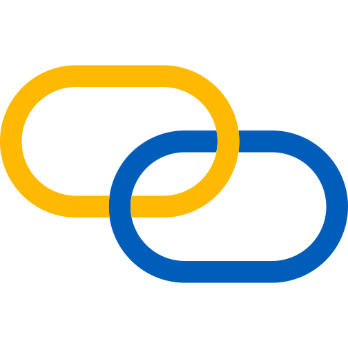

<!-- ================== Greeting ================== -->
<!-- Profile Views are from: https://github.com/antonkomarev/github-profile-views-counter -->
# Zdravíčko! 

<!-- ================== Description ================== -->
##  About us
Hi, we are group of students formally called "hÚRKa" and friends of this original group, studying [Robotics and Cybernetics](https://urk.fei.stuba.sk/) at [Slovak University of Technology, Faculty of Electrical Engineering and Information Technology](https://www.fei.stuba.sk/english.html?page_id=793). We have created this organization to manage our shared school projects. Feel free to look around or discover our personal GitHub profiles linked down below in the Socials section.

<!-- ================== Socials ================== -->
##  Socials
You can find us at:

